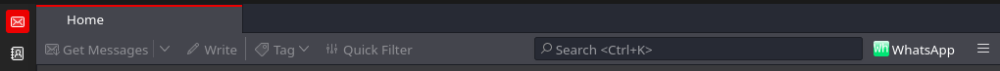
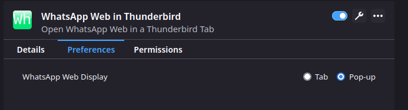
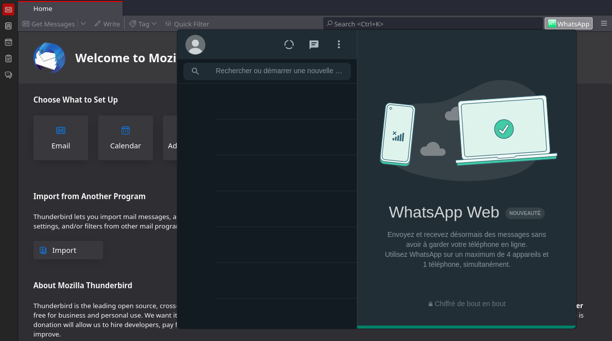

<p align="center"></p>

<h1>WhatsApp Web in Thunderbird</h1>
WhatsApp Web in Thunderbird is a Thunderbird add-on that opens WhatsApp Web in a Thunderbird tab.  

******************
<p align="center">
    <strong>Get it from<br>
    <a href="https://addons.thunderbird.net/thunderbird/addon/whatsapp-web-in-thunderbird/">addons.thunderbird.net</a>
    </strong>
</p>

******************

<h2>How does it work ?</h2>
Once the add-on is installed, a new icon appears in Thunderbird Mail toolbar:


Click on it to open the WhatsApp Web tab.  

You can change add-on preferences to open WhatsApp Web in a pop-up rather than in a tab:  


In that case, the pop-up would look like this:  


<h3>What permissions are needed ?</h3>
WhatsApp Web in Thunderbird will need to access Thunderbird tabs to maintain a unique tab.

<h3>Does WhatsApp Web in Thunderbird collects my data ?</h3>
No, WhatsApp Web in Thunderbird simply opens tabs in Thunderbird, exactly as it would be done in a web browser.  
It does not collect any data.  

Of course, WhatsApp Web works as it would do in your web browser, including regarding their own data collection.  

<h3>So WhatsApp Web in Thunderbird will never collect my data ?</h3>
Never.  

<h3>How do I get rid of the desktop notification message ?</h3>
If you use a web browser to open WhatsApp Web, you should be prompted about desktop notifications. Such a prompt does not exist in Thunderbird. It means that you will see a message in WhatsApp Web without possibility to accept it. It does not prevent WhatsApp Web to work, but it is inconvenient.  

You can disable notifications in WhatsApp Web settings. That makes the prompt disappear.  

If you wish to get desktop notifications, there is a trick to accept them by default. However, please note that it is not specific to WhatsApp Web. If you do this, any website opened in Thunderbird will then be able to send you dekstop notifications. Once you are aware of this, if you still wish to turn on desktop notifications, you can follow these steps :
- open Thunderbird preferences  
- open the configuration editor, usually at the bottom of the "General" tab  
- in the search bar, type `permissions.default.desktop-notification`. Select "Number" and click on the "+" icon to create the variable. Give it a value of 1 (which means "accept by default")  
- close and re-open WhatsApp Web in Thunderbird.  

<h2>Build from source</h2>
Prerequisite:  
Install <a href="(https://nodejs.org">Node.js</a>.  

Building the add-on fron source requires to have a working [Node.js](https://nodejs.org). In addition, some of the package.json scripts would work only in a "*nix" environment. The add-on can be built by running the following command from its root directory:  
```
npm ci
npm run build
```

<h2>Legal notice</h2>

Thunderbird is a registered trademark of the Mozilla Foundation.  
WhatsApp is a registered trademark of WhatsApp LLC.  
GNU is a registered trademark of the Free Software Foundation.  
Linux is a registered trademark of Linus Torvalds.  
Windows is a registered trademark of Microsoft Corporation.  
macOS is a registered trademark of Apple Inc.  
Node.js is a trademark of the OpenJS Foundation.  

The above-mentioned trademarks are only used to refer to products.  
WhatsApp Web in Thunderbird and its developer are not affiliated, sponsored nor endorsed by any of the above-mentioned organizations.  

<h2>Changelog</h2>
1.1.0 -> add space toolbar icon for Thunderbird > 100, diverse fixes
1.0.0 -> first release  
